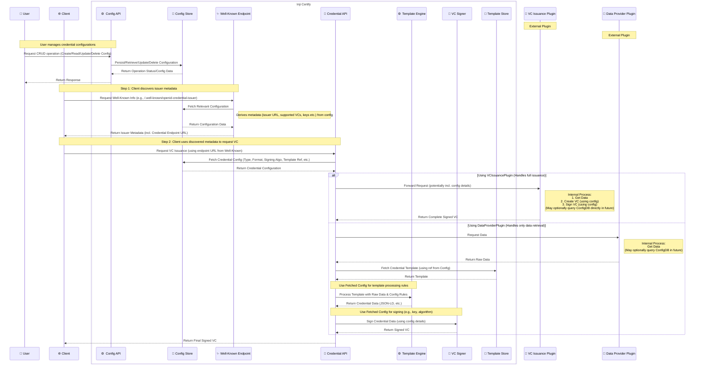

```mermaid
sequenceDiagram
    participant User as 👤 User
    participant Client as 🌐 Client

    box Inji Certify #E6F3FF
        participant ConfigApi as ⚙️ Config API
        participant ConfigDB as 💾 Config Store
        participant WellKnown as ✨ Well-Known Endpoint
        participant credential_endpoint as 🔗 Credential API
        participant VelocityEngine as ⚙️ Template Engine
        participant VCSigner as 🔏 VC Signer
        participant TemplateDB as 💾 Template Store
    end

    participant VCIssuancePlugin as 🔌 VC Issuance Plugin
    participant DataProviderPlugin as 🔌 Data Provider Plugin

    Note over VCIssuancePlugin: External Plugin
    Note over DataProviderPlugin: External Plugin

    %% ------ Configuration Management Flow ------ %%
    Note over User, ConfigApi: User manages credential configurations
    User->>ConfigApi: Request CRUD operation (Create/Read/Update/Delete Config)
    ConfigApi->>ConfigDB: Persist/Retrieve/Update/Delete Configuration
    ConfigDB-->>ConfigApi: Return Operation Status/Config Data
    ConfigApi-->>User: Return Response

    %% ------ VC Issuance Flow (Including Well-Known Discovery) ------ %%

    Note over Client, WellKnown: Step 1: Client discovers issuer metadata
    Client->>WellKnown: Request Well-Known Info (e.g., /.well-known/openid-credential-issuer)
    WellKnown->>ConfigDB: Fetch Relevant Configuration
    Note right of WellKnown: Derives metadata (issuer URL, supported VCs, keys etc.) from config
    ConfigDB-->>WellKnown: Return Configuration Data
    WellKnown-->>Client: Return Issuer Metadata (incl. Credential Endpoint URL)

    Note over Client, credential_endpoint: Step 2: Client uses discovered metadata to request VC
    Client->>credential_endpoint: Request VC Issuance (using endpoint URL from Well-Known)

    credential_endpoint->>ConfigDB: Fetch Credential Config (Type, Format, Signing Algo, Template Ref, etc.)
    ConfigDB-->>credential_endpoint: Return Credential Configuration

    alt Using VCIssuancePlugin (Handles full issuance)
        credential_endpoint->>VCIssuancePlugin: Forward Request (potentially incl. config details)
        Note right of VCIssuancePlugin: Internal Process:<br/>1. Get Data<br/>2. Create VC (using config)<br/>3. Sign VC (using config)<br/>(May optionally query ConfigDB directly in future)
        VCIssuancePlugin-->>credential_endpoint: Return Complete Signed VC

    else Using DataProviderPlugin (Handles only data retrieval)
        credential_endpoint->>DataProviderPlugin: Request Data
        Note right of DataProviderPlugin: Internal Process:<br/>Get Data<br/>(May optionally query ConfigDB in future)
        DataProviderPlugin-->>credential_endpoint: Return Raw Data

        credential_endpoint->>TemplateDB: Fetch Credential Template (using ref from Config)
        TemplateDB-->>credential_endpoint: Return Template

        Note over credential_endpoint, VelocityEngine: Use Fetched Config for template processing rules
        credential_endpoint->>VelocityEngine: Process Template with Raw Data & Config Rules
        VelocityEngine-->>credential_endpoint: Return Credential Data (JSON-LD, etc.)

        Note over credential_endpoint, VCSigner: Use Fetched Config for signing (e.g., key, algorithm)
        credential_endpoint->>VCSigner: Sign Credential Data (using config details)
        VCSigner-->>credential_endpoint: Return Signed VC

    end
    credential_endpoint-->>Client: Return Final Signed VC
```
